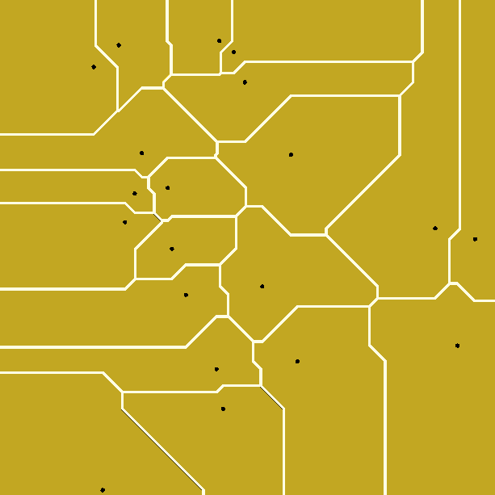

# Manhattan45Voronoi.scad
Construct a Manhattan distance Voronoi diagram on a set of points

Test code in the OpenSCAD file creates this test_Manhattan45Voronoi_Diagram.png

which matches https://en.wikipedia.org/wiki/File:Manhattan_Voronoi_Diagram.svg

on the set of points with coordinates from within the SVG file.
